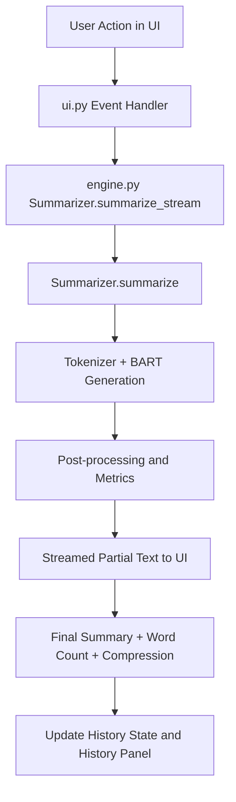

# Summify

Summify is a local AI text summarization app built with Gradio, PyTorch, and Hugging Face Transformers.
It uses `facebook/bart-large-cnn` to generate abstractive summaries and provides a custom UI with style presets, dataset browsing, and summary history.

## Features

- Abstractive summarization using BART Large CNN
- Three summary styles: Concise, Balanced, Detailed
- Adjustable target summary length (word count slider)
- Streaming output (typewriter-style reveal)
- Live input word count and compression stats
- Dataset browser using SQuAD v2 contexts (`train-v2.0.json`)
- Recent summary history (last 5 summaries)
- Custom neobrutalist UI theme

## Project Structure

- `summarizer_app.py` - Main entry point (loads data, model, CSS, launches app)
- `engine.py` - Data loading, style presets, summarization logic
- `ui.py` - Gradio layout and event wiring
- `styles.css` - Custom visual theme and component overrides
- `train-v2.0.json` - Dataset source used for sample contexts

## Architecture

### High-Level Components

- Entry Layer (`summarizer_app.py`): Bootstraps the app, loads dataset/CSS, initializes the model, and launches Gradio.
- Inference Layer (`engine.py`): Handles dataset parsing, style presets, summary generation, safeguards, and stream simulation.
- Presentation Layer (`ui.py`): Builds UI components, binds events, streams output updates, and manages recent-history state.
- Styling Layer (`styles.css`): Applies the neobrutalist visual system and overrides default Gradio styles.
- Data Layer (`train-v2.0.json`): Provides source contexts and article titles from SQuAD v2.0.

### Request Flow



### Runtime Notes

- Model loading happens once at startup and is reused for all requests.
- Device selection is automatic (`cuda` when available, otherwise `cpu`).
- Generation uses deterministic beam search (`do_sample=False`) for stable outputs.
- The visible streaming effect is UI-driven over a completed summary for smoother UX.

## Requirements

- Python 3.9+
- pip

Python packages:

- `gradio`
- `torch`
- `transformers`

## Setup

From the project root:

```powershell
python -m venv venv
.\venv\Scripts\Activate.ps1
pip install gradio torch transformers
```

## Run

```powershell
python summarizer_app.py
```

Then open the local URL shown in terminal (usually `http://127.0.0.1:7860`).

## How to Use

1. Load text by selecting a title, clicking Random, or typing your own text.
2. Choose a style: Concise, Balanced, or Detailed.
3. Adjust target word count.
4. Click **SUMMARIZE ->**.
5. Review output, word-count stats, compression stats, and history.

## Notes

- First launch may take time because model weights are downloaded.
- If CUDA is available, PyTorch will use GPU automatically.
- Input is truncated to model token limits for stability.

## Troubleshooting

### Running `ui.py` does nothing
Use:

```powershell
python summarizer_app.py
```

`ui.py` only defines UI builder functions and does not call `launch()` by itself.

### Missing package errors
Install dependencies in the active environment:

```powershell
pip install gradio torch transformers
```

### PowerShell script execution blocked
If activation is blocked, run:

```powershell
Set-ExecutionPolicy -Scope Process -ExecutionPolicy Bypass
```

Then activate the virtual environment again.

## License

No license file is currently included in this repository.
